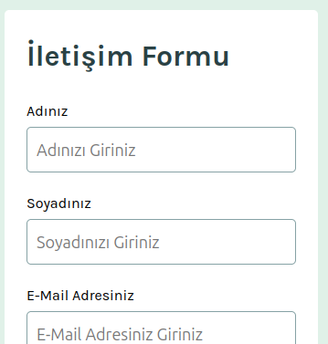

# React + Vite

This template provides a minimal setup to get React working in Vite with HMR and some ESLint rules.

Currently, two official plugins are available:

- [@vitejs/plugin-react](https://github.com/vitejs/vite-plugin-react/blob/main/packages/plugin-react) uses [Oxc](https://oxc.rs)
- [@vitejs/plugin-react-swc](https://github.com/vitejs/vite-plugin-react/blob/main/packages/plugin-react-swc) uses [SWC](https://swc.rs/)

## React Compiler

The React Compiler is not enabled on this template because of its impact on dev & build performances. To add it, see [this documentation](https://react.dev/learn/react-compiler/installation).

## Expanding the ESLint configuration

If you are developing a production application, we recommend using TypeScript with type-aware lint rules enabled. Check out the [TS template](https://github.com/vitejs/vite/tree/main/packages/create-vite/template-react-ts) for information on how to integrate TypeScript and [`typescript-eslint`](https://typescript-eslint.io) in your project.

# TR
# İletişim Formu
React ile geliştirilmiş, kapsamlı form doğrulama ve başarı bildirimi içeren duyarlı bir iletişim formu uygulaması.

## Canlı Önizleme

[Proje önizlemesi.](https://dursunkokturk.github.io/React-JS-Project-Contact-Form)

## Özellikler

- Merkezi Form State Yönetimi — Tüm alanlar tek bir formData objesi üzerinden useState ile yönetilir
- Gerçek Zamanlı Doğrulama — Kullanıcı yazmaya başlar başlamaz ilgili alan hatası temizlenir
- E-posta Regex Kontrolü — Geçersiz formatlı e-posta adresleri anlık olarak tespit edilir
- Sorgu Türü Seçimi — "Genel Sorular" ve "Destek Talebi" seçenekli radyo butonları
- KVKK Onay Kutusu — Gönderim için zorunlu iletişim izni checkbox'ı
- Başarı Bildirimi — Form gönderildikten sonra 5 saniye ekranda kalan animasyonlu bildirim kartı
- Otomatik Form Sıfırlama — Başarılı gönderimden sonra tüm alanlar temizlenir
- Duyarlı Tasarım — Mobil, tablet ve masaüstü için ayrı düzenler

## Form Alanları
 
| Alan          | Tür      | Zorunlu | Özel Kontrol               |
| ------------- |----------| --------|----------------------------|
| Ad            | Text     |    ✅   |    —                       |
| Soyad         | Text     |    ✅   |    —                       |
| E-Mail        | Text     |    ✅   | Regex ile format doğrulama |
| Sorgu Türü    | Radio    |    ✅   |    —                       |
| Mesaj         | Textarea |    ✅   |    —                       |
| İletişim İzni | Checkbox |    ✅   |    —                       |

## Duyarlı Düzenler

| Ekran    | Genişlik         | Öne Çıkan Değişiklikler                   |
| -------- |------------------| ------------------------------------------|
| Mobil    | 375px Varsayılan | Tek sütun, dikey form akışı               |
| Tablet   | > 767px          | Ad ve Soyad yan yana, sorgu türleri yatay |
| Masaüstü | > 1109px         | Form ortalanmış, geniş kenar boşlukları   |

## Teknolojiler

| Teknoloji    | Açıklama                                               |
| ------------ |--------------------------------------------------------|
| React 18     | Bileşen yapısı ve state yönetimi (useState, useEffect) |
| CSS3         | Flexbox, @media sorguları, özel focus stilleri         |
| Google Fonts | Karla yazı ailesi                                      |

## Proje Yapısı
src/  
├── App.jsx  
├── App.css  
└── assets/  
    └── Components/  
        └── ContactForm.jsx  

## Kurulum
bash# Repoyu klonlayın   
git clone https://github.com/dursunkokturk/React-JS-Project-Contact-Form.git

### Proje klasörüne girin
cd React-JS-Project-Contact-Form

### Bağımlılıkları yükleyin
npm install

### Geliştirme sunucusunu başlatın
npm run dev  
Tarayıcınızda http://localhost:5173 adresini açın.

## Tasarım Detayları

- Renk Paleti:

  - #E0F1E8 — Açık yeşil (arka plan, seçili radyo arka planı)
  - #0C7D69 — Koyu yeşil (buton, focus kenarlığı, seçili radyo kenarlığı)
  - #2A4144 — Koyu yeşil-gri (başlıklar, başarı bildirimi arka planı)
  - #86A2A5 — Gri-mavi (input kenarlıkları)

- Font: Karla

# EN
# Contact Form
A responsive contact form application built with React, featuring comprehensive form validation and a success notification.

Live Preview
[Project preview.](https://dursunkokturk.github.io/React-JS-Project-Contact-Form)

## Features

- Centralized Form State Management — All fields are managed through a single formData object using useState
- Real-Time Validation — The relevant field error clears as soon as the user starts typing
- Email Regex Check — Incorrectly formatted email addresses are detected instantly
- Query Type Selection — Radio buttons with "General Enquiry" and "Support Request" options
- Consent Checkbox — A mandatory contact permission checkbox required for submission
- Success Notification — An animated notification card that stays on screen for 5 seconds after the form is submitted
- Automatic Form Reset — All fields are cleared after a successful submission
- Responsive Design — Separate layouts for mobile, tablet, and desktop

## Form Fields

| Field           | Type     | Required | Special Validation          |
| --------------- |----------| ---------|-----------------------------|
| First Name      | Text     |    ✅    |    —                        |
| Last Name       | Text     |    ✅    |    —                        |
| E-Mail          | Text     |    ✅    | Format validation via Regex |
| Query Type      | Radio    |    ✅    |    —                        |
| Message         | Textarea |    ✅    |    —                        |
| Contact Consent | Checkbox |    ✅    |    —                        |

## Responsive Layouts

| Screen  | Width         | Key Changes                                              |
| ------- |---------------| ---------------------------------------------------------|
| Mobile  | 375px Default | Single column, vertical form flow                        |
| Tablet  | > 767px       | First and last name side by side, query types horizontal |
| Desktop | > 1109px      | Form centered, wide margins                              |

## Technologies

| Technology   | Description                                                    |
| ------------ |----------------------------------------------------------------|
| React 18     | Component structure and state management (useState, useEffect) |
| CSS3         | Flexbox, @media queries, custom focus styles                   |
| Google Fonts | Karla font family                                              |

## Project Structure
src/  
├── App.jsx  
├── App.css  
└── assets/  
    └── Components/  
        └── ContactForm.jsx  
        
## Installation
bash# Clone the repo   
git clone https://github.com/dursunkokturk/React-JS-Project-Contact-Form.git

### Navigate to the project folder
cd React-JS-Project-Contact-Form

### Install dependencies
npm install

### Start the development server
npm run dev
Open http://localhost:5173 in your browser.

## Design Details

- Color Palette:

  - #E0F1E8 — Light green (background, selected radio background)
  - #0C7D69 — Dark green (button, focus border, selected radio border)
  - #2A4144 — Dark green-gray (headings, success notification background)
  - #86A2A5 — Gray-blue (input borders)

- Font: Karla
